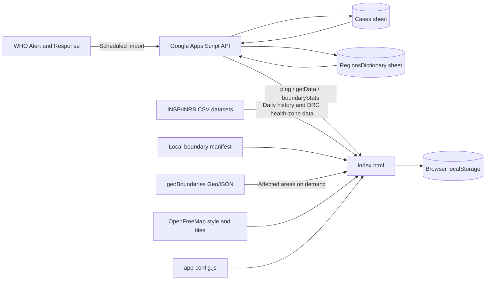

# Ebola Outbreak 2026 Dashboard

🌐 **Live Dashboard:** [https://benard10.github.io/Ebola-Outbreak-2026-Lens/](https://benard10.github.io/Ebola-Outbreak-2026-Lens/)

An interactive Ebola surveillance dashboard with a Google Sheets and Google Apps Script backend. It combines national WHO snapshots, field-entered case records, public daily situation-report datasets, and on-demand administrative boundaries.

## What the application provides

- Headline totals for confirmed cases, suspected cases, deaths, and recoveries.
- Confirmed case-fatality and recovery-rate indicators.
- An interactive MapLibre map with choropleth and point modes.
- Map metric selection for total cases, confirmed cases, deaths, and recoveries.
- Country and province filters that update the map, headline statistics, and charts together.
- A daily growth curve with cumulative cases, newly reported cases, and optional deaths.
- Geographic rankings at country, province, or health-zone level.
- Automatic refresh, manual refresh, and cached startup data for rapid loading.

## System architecture



The application has three main layers:

1. **Presentation layer:** `index.html` renders the public surveillance dashboard.
2. **Configuration and data layer:** `app-config.js` provides one shared API URL, refresh intervals, map thresholds, and fallback source URLs.
3. **Backend layer:** `Code.gs` reads and writes Google Sheets, imports WHO statistics, aggregates the API response, caches it, and exposes web-app endpoints.

## Project structure

```text
.
├── index.html                     Main dashboard UI and browser-side logic
├── app-config.js                  Shared frontend configuration and API URL
├── Code.gs                        Google Apps Script backend
├── README.md                      Architecture, operation, and deployment guide
├── data/
│   └── gis/world/
│       └── manifest.json          Country and ADM0-ADM4 boundary catalog
└── scripts/
    ├── prepare-boundaries.mjs     Rebuilds the boundary manifest
    └── verify-live.mjs            Tests the deployed API and affected boundaries
```

## Technology

- HTML5, CSS3, and browser JavaScript
- MapLibre GL JS for the interactive map
- Chart.js for trends, rankings, and caseload charts
- Google Apps Script for the HTTP API and scheduled imports
- Google Sheets for persistent case and location data
- OpenFreeMap for the basemap
- geoBoundaries for administrative geometry
- WHO Alert and Response for national outbreak snapshots
- INSP/INRB public CSV datasets for DRC daily and health-zone reporting

## Front-to-back operation

### 1. Dashboard startup

When `index.html` opens:

1. It loads `app-config.js` and obtains the Apps Script web-app URL and fallback source registry.
2. It immediately restores the last successful dashboard payload from `localStorage`, when available, so the interface does not wait on the network before showing data.
3. It starts the basemap and loads the local boundary manifest independently of the API.
4. It calls `GET ?action=ping` to confirm that the backend is available and to obtain:
   - the API version;
   - the current data revision;
   - the refresh interval; and
   - the authoritative source registry.
5. If the cached version and data revision still match the backend, it keeps the cached payload and avoids an unnecessary full spreadsheet read.
6. If the revision changed, no cache exists, or the user selected **Refresh now**, it calls `GET ?action=getData` and renders the new payload.
7. Daily history, DRC health-zone data, and detailed map geometry load asynchronously so they do not delay headline figures or controls.

### 2. Backend aggregation

`Code.gs` reads the `Cases` sheet and separates two record types:

- **WHO snapshots:** rows whose `Status` is `WHO_SNAPSHOT`. These are national cumulative statistics imported from WHO.
- **Field records:** records entered into the spreadsheet (or via API). These supply local detail such as province, health zone, coordinates, and provisional new cases.

The newest WHO snapshot drives national headline totals and the main timeline. Field records created after that snapshot are added as provisional updates so a newly reported case can appear immediately without waiting for the next WHO publication.

WHO national totals are not copied into every province or health zone. This prevents national figures from being double-counted when the user drills into a country.

The `getData` response contains:

- `totals` — national headline totals and source metadata;
- `timeline` — dated cumulative observations;
- `provinces` — aggregated field records by province;
- `zones` — mapped field locations with valid coordinates;
- `boundaryStats` — normalized local statistics for boundary matching; and
- `map` — compact national, administrative, and point data for map rendering.

### 3. Historical and subnational enrichment

The browser fetches the INSP/INRB CSV sources listed in the runtime source registry:

- national cumulative confirmed cases;
- national cumulative confirmed deaths;
- confirmed cases by DRC health zone; and
- confirmed deaths by DRC health zone.

National daily records are merged by date with the API timeline. When both sources cover the same date, the dashboard keeps the most complete cumulative value. The latest health-zone values populate the DRC subnational ranking when that country is selected.

These public health-zone files currently provide ranking detail, but they do not provide a complete historical geographic snapshot series for every country. Geographic date playback therefore remains disabled to avoid presenting a misleading animation.

### 4. Map pipeline

The basemap can initialize even when the Apps Script API is unavailable. Statistical overlays are added when data arrives.

1. `data/gis/world/manifest.json` resolves country names and ISO3 codes to available ADM0-ADM4 boundary files.
2. Only affected countries are requested, instead of shipping all worldwide geometry at startup.
3. ADM0 national polygons receive national statistics.
4. Deeper boundaries receive data only when matching province, district, or health-zone records exist.
5. Field records with coordinates are available in point and cluster mode.
6. The selected metric and thresholds from `app-config.js` determine choropleth colors and legend values.

The **ADM Auto** option selects detail according to zoom. ADM0-ADM4 can also be selected manually. New countries can be displayed without changing rendering code when their name can be resolved through the global boundary catalog.

### 5. Charts and filters

- The country and province selectors create a filtered dashboard view without changing the stored source payload.
- The growth chart supports the most recent 14 reports, 30 reports, or all available history.
- The geographic chart changes scope automatically:
  - all countries when no country is selected;
  - provinces or public health-zone data when a country is selected; and
  - health zones when a province is selected.
- The geographic ranking can show the top 5, top 10, or all entries.
- The caseload doughnut summarizes confirmed, suspected, and death figures.
- Cases per 100,000 remains disabled until a reliable population dataset is added.

### 6. Refresh and caching behavior

The system uses two complementary caches:

- **Apps Script cache:** `getData` responses are cached for 25 seconds to reduce spreadsheet reads.
- **Browser cache:** the latest successful payload is stored in `localStorage` with its API version and data revision.

Every case data change or WHO import clears the Apps Script cache and writes a new `DASHBOARD_DATA_REVISION_MS` value. The dashboard checks this revision every 30 seconds by default. A full payload is downloaded only when necessary.

The **Refresh now** button bypasses the normal API cache with `fresh=1`. The **Auto** button enables or disables periodic checks.

If the backend is temporarily unavailable, the dashboard keeps showing the saved payload and clearly marks it as cached.

## Google Sheets structure

The spreadsheet must contain these tabs.

### `Cases`

The backend matches headers without regard to spaces or capitalization. The supported columns are:

| Column              | Purpose                                                                     |
| ------------------- | --------------------------------------------------------------------------- |
| `Country`         | Country name                                                                |
| `Province`        | Province or first-level administrative area                                 |
| `HealthZone`      | Health zone, district, or reporting location                                |
| `Lat`, `Lon`    | Optional record coordinates                                                 |
| `ConfirmedCases`  | Confirmed cases                                                             |
| `SuspectedCases`  | Suspected cases                                                             |
| `DeathsConfirmed` | Confirmed deaths                                                            |
| `DeathsSuspected` | Suspected or probable deaths                                                |
| `Recovered`       | Recoveries                                                                  |
| `Status`          | `ACTIVE` for field records or `WHO_SNAPSHOT` for imported national rows |
| `LastUpdated`     | Reporting or snapshot date                                                  |
| `ImportedAt`      | Time the row entered the system                                             |
| `Notes`           | Optional notes and WHO snapshot metadata                                    |
| `SourceURL`       | Optional source URL                                                         |
| `ProbableCases`   | Probable cases from WHO                                                     |
| `CountryDataAsOf` | The date reported for an individual WHO country row                         |
| `CFR`             | WHO-provided case-fatality percentage                                       |

The WHO import adds any missing WHO-specific columns automatically.

### `RegionsDictionary`

| Column         | Purpose              |
| -------------- | -------------------- |
| `Country`    | Country name         |
| `Province`   | Province name        |
| `HealthZone` | Local reporting area |
| `Lat`        | Latitude             |
| `Lon`        | Longitude            |

The dictionary supplies coordinates when a case row does not contain them directly. New locations with valid coordinates can be upserted automatically.

## Apps Script API

| Method   | Action               | Access         | Purpose                                                                                     |
| -------- | -------------------- | -------------- | ------------------------------------------------------------------------------------------- |
| `GET`  | `ping`             | Public         | Lightweight health check, API version, data revision, refresh interval, and source registry |
| `GET`  | `getData`          | Public         | Aggregated dashboard payload; add`fresh=1` to bypass the backend cache                    |
| `GET`  | `getBoundaryStats` | Public         | Normalized statistics used for boundary matching                                            |
| `POST` | `requestLoginCode` | Public, rate-limited | Emails a six-digit one-time code to the configured administrator                        |
| `POST` | `verifyLoginCode`  | One-time code   | Returns a temporary 30-minute session token                                                 |
| `POST` | `getDictionary`    | Session token required | Returns the nested location dictionary                                                      |
| `GET`  | `triggerSync`      | Token required | Runs the WHO import immediately                                                             |
| `POST` | `addCase`          | Token required | Appends a field case and optionally updates the location dictionary                         |

All API responses are JSON. Operational errors are returned as an `error` property.

## Configuration

Edit `app-config.js` for frontend settings:

- `apiBase` — deployed Apps Script `/exec` URL;
- `autoRefreshMs` — backend revision-check interval;
- `historyRefreshMs` — refresh lifetime for external history and subnational CSV data;
- `dashboardStorageKey` — browser cache key;
- `refreshSignalKey` — cross-tab refresh signal;
- `mapThresholds` — moderate and high thresholds for each map metric; and
- `sources` — fallback source URLs used until `ping` returns the backend registry.

The source registry returned by the backend overrides matching frontend fallback values. This allows source URLs to be updated centrally after `Code.gs` is redeployed.

## Setup and deployment

### 1. Prepare Google Sheets

1. Open the Google Sheet associated with **Ebola Outbreak – Dynamic Map**.
2. Create or verify the `Cases` and `RegionsDictionary` tabs.
3. Add the headers documented above.
4. Populate `RegionsDictionary` with known locations and coordinates when available.

### 2. Deploy the backend

1. Open the sheet's Apps Script project.
2. Replace its backend source with `Code.gs`.
3. In **Project Settings → Script properties**, create `ADMIN_EMAIL` with the address that should receive one-time login codes.
4. Optionally create `ADMIN_TOKEN` with a strong emergency or automation token.
5. Save the project.
6. Run `requestAdminLoginCode()` once from the editor if Google needs permission to send email. A code will be sent to `ADMIN_EMAIL`.
7. Run `importExternalData()` once from the editor and approve the required Google permissions.
8. Run `setupAutomation()` once. It removes existing `importExternalData` triggers and creates daily imports at approximately 06:00, 14:00, and 21:00 in the Apps Script project's configured timezone.
9. Deploy as a Web App with access set to the intended audience.
10. For later backend changes, edit the existing deployment and select **New version** so its `/exec` URL remains stable.

### 3. Configure and host the frontend

1. Put the deployed `/exec` URL in `app-config.js` as `apiBase`.
2. Host `index.html`, `app-config.js`, and the `data` directory from the same static site root.
3. Do not open the pages through `file://`; use a local or hosted HTTP server so browser fetches work consistently.

### 4. Refresh the boundary catalog

Run:

```bash
node scripts/prepare-boundaries.mjs
```

This rebuilds `data/gis/world/manifest.json`. It catalogs worldwide ADM0-ADM4 availability without downloading and bundling every polygon.

### 5. Verify a deployment

Run:

```bash
node scripts/verify-live.mjs
```

The verification script reads `apiBase` from `app-config.js`, checks `ping` and `getData`, summarizes the map payload, and confirms that ADM0 geometry is available for affected countries.

## Operational notes

- Increment `API_VERSION` when a backend response change should invalidate browser and Apps Script caches.
- Update the existing Apps Script deployment after every `Code.gs` change; saving in the editor alone does not update the deployed web app.
- A WHO page-layout change can break the HTML table parser. The import returns an error instead of deleting existing snapshots.
- Country, province, and health-zone names are normalized for matching, but consistent spelling still produces the best boundary results.

## Security considerations

The backend uses emailed one-time codes and short-lived session tokens for administrative actions.

- Store the administrator address only as the `ADMIN_EMAIL` Apps Script Property.
- If an emergency `ADMIN_TOKEN` is used, store it only in Apps Script Properties and never in browser code.
- Never commit email addresses, tokens, login codes, or session tokens to a repository, example file, screenshot, or deployment note.
- Login codes expire after 10 minutes, allow at most five incorrect attempts, and are limited to one request per minute and five requests per hour.
- Session tokens expire after 30 minutes.
- Email delivery is subject to the Apps Script account's Mail service quota.
- The deployed Apps Script `/exec` URL and public source URLs are intentionally present in frontend configuration because browsers must be able to request them; they are identifiers, not authentication secrets.
- Rotate the token if it has been exposed.
- Restrict the Web App audience where operational requirements allow it.
- Use HTTPS hosting for the frontend.
- For a public or multi-user deployment, replace the shared token with authenticated user identities and server-side authorization.

## Current limitations

- Population data is not included, so rates per 100,000 are unavailable.
- Geographic playback is disabled until reliable historical province or health-zone snapshots exist.
- Public subnational coverage is currently strongest for DRC; other countries depend on field records or future structured sources.
- Browser-side CSV parsing assumes the current INSP/INRB column structure.

## Disclaimer

This dashboard is a surveillance and analytical tool. Validate figures against the cited health authority before using them for operational or public-health decisions.
